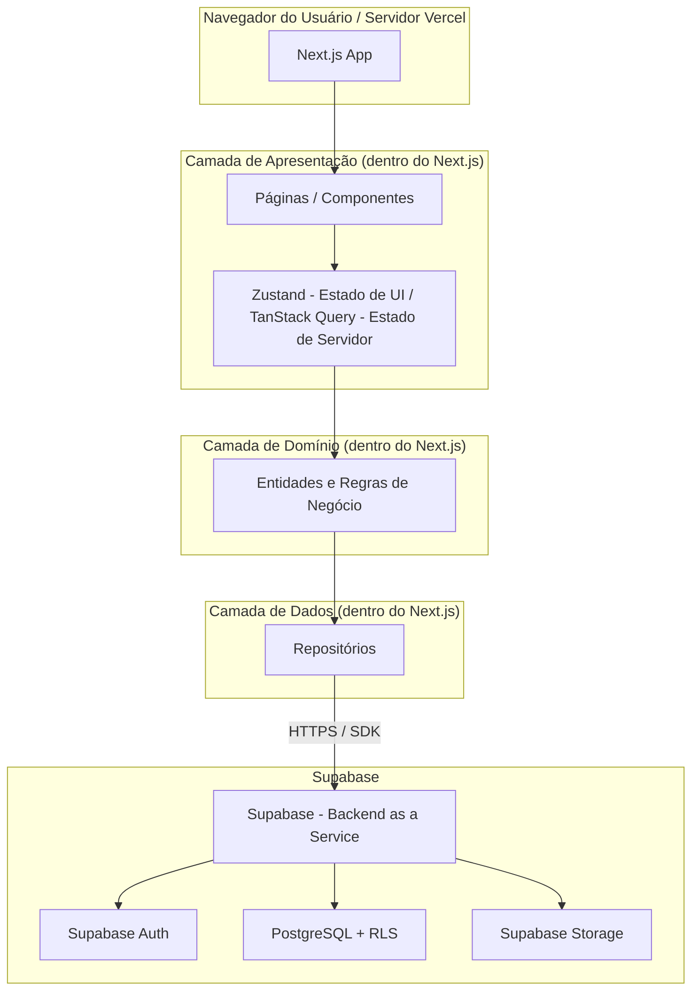

# Arquitetura — Visão Técnica Consolidada

Este documento fecha o Módulo 01 juntando tudo que foi decidido nos documentos anteriores (visão geral, funcionalidades, requisitos, stack e decisões técnicas) em um único diagrama técnico. Enquanto `01-visao-geral.md` explica o conceito com uma analogia (restaurante), aqui apresentamos a arquitetura de forma mais formal, como ela vai existir de fato.

## 1. Diagrama Completo de Camadas

## 2. Como as Camadas se Conectam (de cima para baixo)

1. **Navegador/Vercel → Next.js:** O usuário interage com a interface; parte dela pode já vir renderizada do servidor da Vercel (Server Components), parte roda no navegador (Client Components) — ver nota em `01-visao-geral.md`.
2. **Apresentação (Zustand + TanStack Query):** Captura o clique/ação e decide o que fazer. Zustand guarda estado de interface; TanStack Query guarda e sincroniza os dados vindos do Supabase, sem a camada de apresentação precisar saber *como* eles são buscados.
3. **Domínio:** Contém as regras puras (ex: "um documento não pode ter título vazio"), sem depender do Next.js nem do Supabase.
4. **Dados (Repositórios):** Traduz as chamadas do domínio em requisições reais ao Supabase.
5. **Supabase:** Valida autenticação (Auth), aplica as políticas de RLS e executa a query no PostgreSQL, retornando só os dados que pertencem ao usuário logado.

## 3. Onde a Segurança Entra no Fluxo

A segurança não é uma camada isolada — ela atravessa o fluxo em dois pontos (ver ADR 04 em `06-decisoes-tecnicas.md`):
- **Supabase Auth:** garante que só usuários autenticados cheguem até o banco.
- **RLS no PostgreSQL:** garante que, mesmo autenticado, o usuário só enxergue as próprias linhas (`auth.uid()`).

## 4. Onde Cada Documento do Módulo 01 se Encaixa

| Documento | Responde à pergunta |
|---|---|
| `01-visao-geral.md` | Por que Cliente-Servidor? (conceito) |
| `02-funcionalidades.md` | Quais funcionalidades existem e onde moram no código? |
| `03-requisitos-funcionais.md` | O que o sistema faz, em detalhe? |
| `04-requisitos-nao-funcionais.md` | Como o sistema se comporta (segurança, performance, plataforma)? |
| `05-stack-tecnologica.md` | Quais tecnologias, e por quê? |
| `06-decisoes-tecnicas.md` | Quais decisões de arquitetura foram tomadas, com alternativas descartadas? |
| `07-arquitetura-geral.md` (este documento) | Como tudo se conecta, de ponta a ponta? |
| `08-estrutura-do-projeto.md` | Como o repositório é organizado fisicamente? |

## 5. Relação com o Deploy (Módulo 07)

Este diagrama descreve a arquitetura **em execução**. Como cada camada chega até o ar (build, CI/CD, hospedagem) é detalhado à parte em `docs/07-deploy/01-ambientes-e-pipeline.md`, para não misturar "como o sistema funciona" com "como o sistema é publicado".
