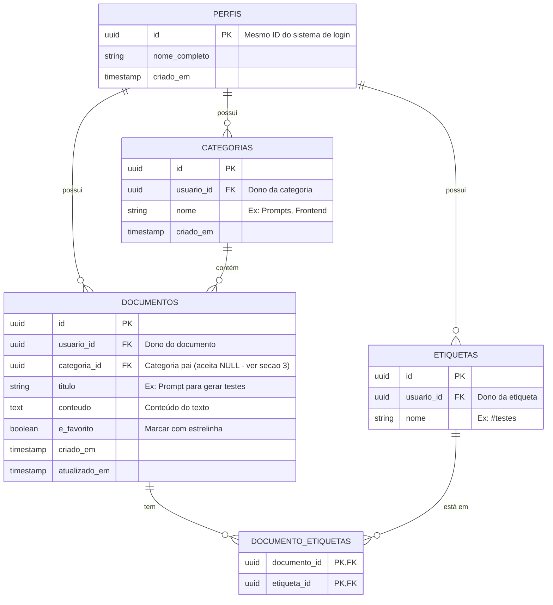

# Banco de Dados — Modelo Conceitual e Entidades

O banco de dados escolhido para a aplicação é o **PostgreSQL** (fornecido pelo Supabase). Este documento descreve as tabelas (entidades) e como elas se relacionam.

> **💡 Nota de Aprendizado (Mentoria):** 
> No mercado de trabalho e em projetos grandes, é um padrão internacional nomear tabelas e colunas no banco de dados em **Inglês** (ex: `users`, `documents`, `created_at`), mesmo que o sistema seja para brasileiros. Isso facilita integrações e contratações futuras.
> No entanto, como este projeto tem fins didáticos e pessoais, traduzimos todas as estruturas para **Português** para facilitar o entendimento lógico da modelagem!

## 1. Diagrama de Entidade-Relacionamento (ERD)

Abaixo temos o diagrama visual das nossas tabelas. 
*Nota: A tabela de autenticação (senhas e emails) é gerenciada automaticamente pelo Supabase de forma escondida, por isso nosso sistema foca apenas nos dados do aplicativo.*



## 2. Descrição das Tabelas e Dicionário de Dados Inicial

### Tabela `perfis` (Perfil do Usuário)
Guarda os dados públicos do seu usuário, caso no futuro você queira adicionar foto de perfil ou um nome de exibição.
- `id`: O identificador único (UUID).
- `nome_completo`: Seu nome.
- `criado_em`: Data em que a conta foi criada.

### Tabela `categorias` (Pastas Principais)
As pastas macros para organização do menu lateral.
- `id`: Identificador único.
- `usuario_id`: Referência para saber quem criou (Crucial para a segurança RLS).
- `nome`: Nome da categoria (ex: "SQL Queries").

### Tabela `documentos` (Os Prompts e Textos)
Onde reside o valor real da aplicação. O conteúdo que você salva.
- `id`: Identificador único.
- `usuario_id`: O dono do documento.
- `categoria_id`: Em qual pasta/categoria ele está inserido.
- `titulo`: O título que vai aparecer na busca e na lista.
- `conteudo`: O texto principal (onde você vai colar os Prompts e Códigos).
- `e_favorito`: Campo verdadeiro ou falso. Se for verdadeiro, vai aparecer no menu rápido de "Favoritos".
- `criado_em` e `atualizado_em`: Datas de controle.

### Tabela `etiquetas` (Tags) e `documento_etiquetas`
- Uma etiqueta (`etiquetas`) pode estar em vários documentos, e um documento pode ter várias etiquetas. 
- Por isso criamos a tabela auxiliar `documento_etiquetas` para cruzar esses dados. Isso permite filtrar facilmente no futuro tudo que tiver a etiqueta `#dart` ou `#QA`.

## 3. Regras de Integridade Referencial (ON DELETE)

> 💡 **Nota de Aprendizado (Mentoria):** toda `FOREIGN KEY` precisa responder "o que acontece do outro lado quando eu apago o registro pai?". Não decidir isso explicitamente não significa que o banco não decide sozinho — o padrão do PostgreSQL quando nada é especificado é `NO ACTION` (que na prática bloqueia a exclusão com um erro se houver algo referenciando). Melhor decidir conscientemente do que descobrir isso do jeito difícil, em produção.

| Relação | Regra | Por quê |
|---|---|---|
| `documentos.categoria_id` → `categorias.id` | **`ON DELETE SET NULL`** | O valor central do app é nunca perder conhecimento. Apagar uma categoria não pode arrastar documentos junto — eles só ficam "sem categoria" (continuam visíveis em "Todos os documentos"). Por isso `categoria_id` precisa ser uma coluna **nullable** (sem `NOT NULL`). |
| `documento_etiquetas.documento_id` → `documentos.id` | `ON DELETE CASCADE` | Se o documento em si foi apagado (ação explícita e consciente do usuário, ver RF02.4), não faz sentido manter a associação de etiqueta órfã. |
| `documento_etiquetas.etiqueta_id` → `etiquetas.id` | `ON DELETE CASCADE` | Apagar uma etiqueta remove só a associação (a linha em `documento_etiquetas`) — o documento em si nunca é afetado. |
| `categorias.usuario_id`, `documentos.usuario_id`, `etiquetas.usuario_id` → `perfis.id` | `ON DELETE CASCADE` | Se a conta do usuário for apagada (fora do escopo do MVP, mas é o padrão esperado), os dados dela são removidos por completo — não faz sentido manter dados órfãos sem dono. |

**Trade-off consciente:** `SET NULL` em vez de `RESTRICT` para categorias significa que apagar uma categoria é uma ação "silenciosa" (não bloqueia, não avisa quantos documentos serão desvinculados). Isso é aceitável aqui por ser um app de uso pessoal e single-user — mas vale considerar, na tela de exclusão de categoria, mostrar quantos documentos serão desvinculados antes de confirmar (nota de UX para quando `docs/05-ui-ux/03-telas-e-componentes.md` cobrir a tela de Categorias).

## 4. Unicidade de Nomes (Categorias e Etiquetas)

Sem uma regra explícita, é fácil criar "QA" e "qa" sem perceber e fragmentar os próprios dados (a mesma categoria "existindo" duas vezes com grafias diferentes). Uma `UNIQUE(usuario_id, nome)` comum **não resolve isso**: "QA" e "qa" são strings diferentes para o banco, então essa constraint deixaria as duas coexistirem.

**Decisão:** usar um índice único por **expressão**, aplicando `lower()` (case-insensitive) e `trim()` (ignora espaços nas pontas) na comparação — mas guardando o nome como o usuário digitou, para exibição:

```sql
create unique index categorias_usuario_nome_unico
  on categorias (usuario_id, lower(trim(nome)));

create unique index etiquetas_usuario_nome_unico
  on etiquetas (usuario_id, lower(trim(nome)));
```

**Consequência prática:** se o usuário tentar criar "qa" já tendo "QA", o Supabase retorna um erro de violação de unicidade — a camada de `dados/` (repositório) precisa tratar esse erro e mostrar uma mensagem amigável (ex: "Você já tem uma categoria chamada 'QA'"), em vez de deixar o erro bruto do Postgres vazar pra tela.
